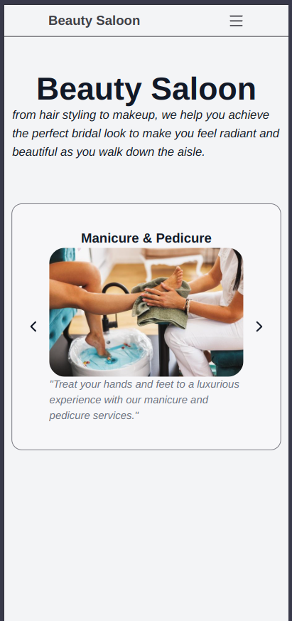

# Salon Website



## Description

This is a responsive and modern salon website built using **React** and **Tailwind CSS**. The website allows users to explore various salon services such as **Manicure & Pedicure**, **Facial**, **Hair Treatment**, **Hair Cut**, and **Bridal**. The UI is designed with a focus on simplicity and user-friendliness, including a rotating display of service images with navigation arrows.

## Features

- **Responsive Design**: Adapts to different screen sizes.
- **Modern UI**: Clean, user-friendly interface designed with Tailwind CSS.
- **Service Display**: Showcases salon services with images, descriptions, and transitions.
- **Navigation**: Easily navigate through different services using left and right arrows.

## Technologies Used

- **React**: A JavaScript library for building user interfaces.
- **Tailwind CSS**: A utility-first CSS framework for styling.
- **React Icons**: For incorporating icons like navigation arrows.

## Installation

1. Clone the repository:

   ```bash
   git clone https://github.com/your-username/salon-website.git
2. Navigate to the project directory:
   ```bash
      cd salon-website
      npm install


### Key Points Added:
1. **Deployment Instructions**: Included steps for deploying to Vercel and Netlify, two popular hosting platforms.
2. **Tailwind CSS Tips**: Added practical tips for using Tailwind CSS effectively.

Feel free to modify the instructions based on the specific deployment platform or Tailwind CSS tips that suit your project best!
